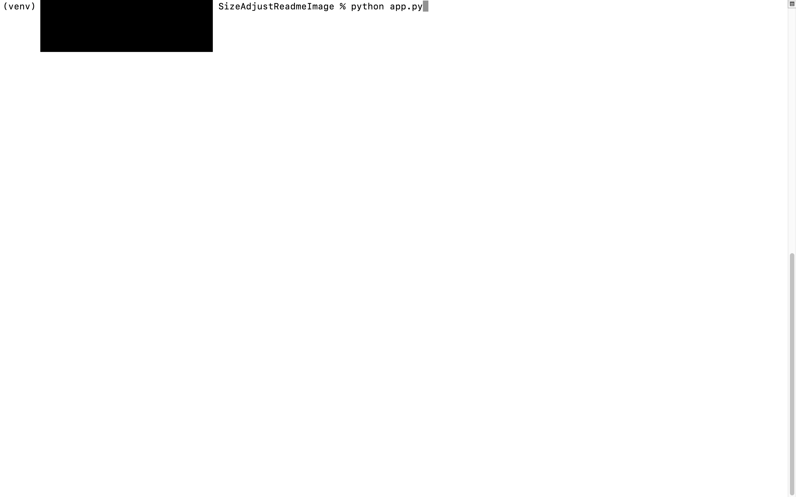
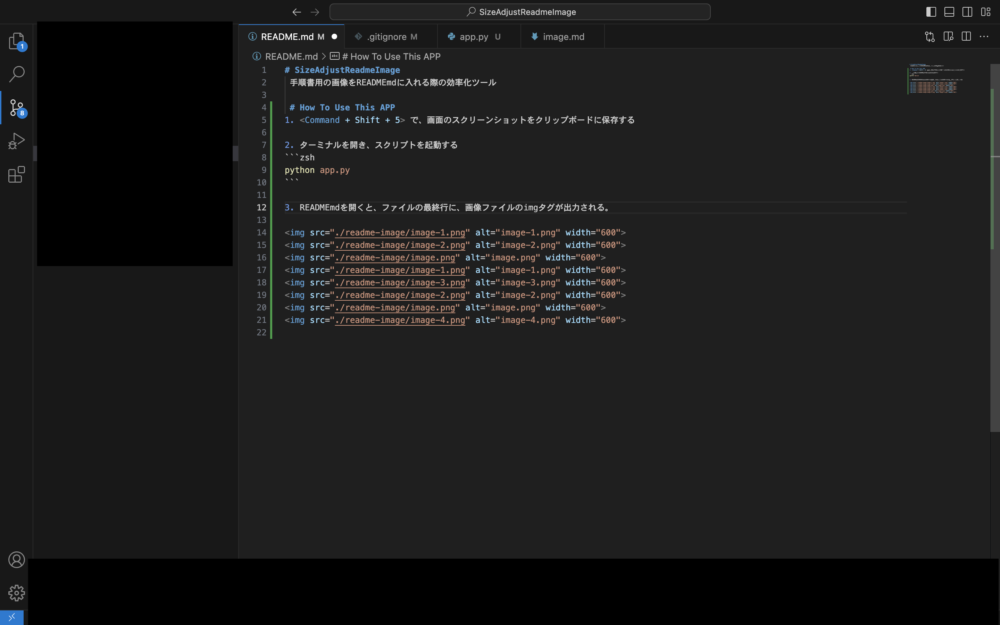

# SizeAdjustReadmeImage
 手順書用の画像をREADMEmdに入れる際の効率化ツール

 # How To Use This APP
1. <Command + Shift + 5> で、画面のスクリーンショットをクリップボードに保存する


2. ターミナルを開き、スクリプトを起動する
```zsh
python app.py
```


3. READMEmdを開くと、ファイルの最終行に、画像ファイルのimgタグが出力される。

